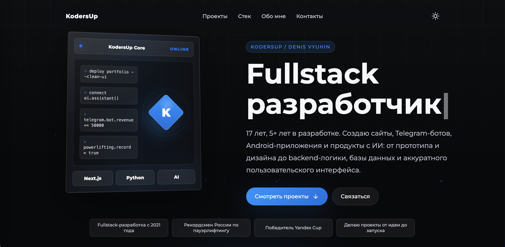

# KodersUp Portfolio

Это мой сайт-портфолио: здесь собраны проекты, стек, опыт, контакты и резюме.



## Сайт

На главной странице есть всё, что нужно для быстрого знакомства:

- интерактивный hero-блок с кратким описанием;
- список проектов с описанием, стеком, ссылками и GitHub;
- секция навыков по направлениям: фронтенд, бекенд, инструменты;
- блок “Обо мне” с опытом, фактами и кнопкой скачивания резюме;
- контакты: Telegram, GitHub, VK и Email;
- поддержка светлой и тёмной темы.

## Стек

- **Next.js 16** — App Router, сборка через Turbopack.
- **React 19** — компоненты интерфейса.
- **Tailwind CSS 4** и глобальные CSS-модули — стилизация.
- **GSAP**, **Motion**, **OGL** — анимации, частицы и визуальные эффекты.
- **next-themes** — переключение темы.
- **react-icons** — иконки интерфейса.
- **Vercel Speed Insights** — метрики производительности.

## Запуск

Требуется Node.js `18.17+` или новее.

Установить зависимости:

```bash
npm install
```

Запустить проект в режиме разработки:

```bash
npm run dev
```

Открыть в браузере:

```text
http://localhost:3000
```

## Сборка

Собрать production-версию:

```bash
npm run build
```

Запустить собранный проект:

```bash
npm run start
```

## Структура

```text
src/app/
  layout.jsx                общий layout, метаданные, шрифт, Header и фоновые частицы
  page.jsx                  главная страница: hero, проекты, стек, обо мне и контакты
  globals.css               глобальные стили, темы и базовая адаптивность
  loading.jsx               экран загрузки
  not-found.jsx             страница 404

src/Components/
  Header/                   верхняя навигация и переключатель темы
  Footer/                   нижний блок сайта
  ProjectCard/              карточки проектов
  Animations/               анимированный текст, частицы, aurora-эффекты

src/Utils/
  ThemeProvider.jsx         провайдер темы для next-themes
  GetSystemTheme.jsx        определение системной темы

public/
  icons/                    favicon, shortcut icon и apple touch icon
  *.webp                    изображения для hero, стека и проектов
  denis-vyuhin-resume.txt   резюме для скачивания
  readme-preview.png        скрин главного экрана для README
```
